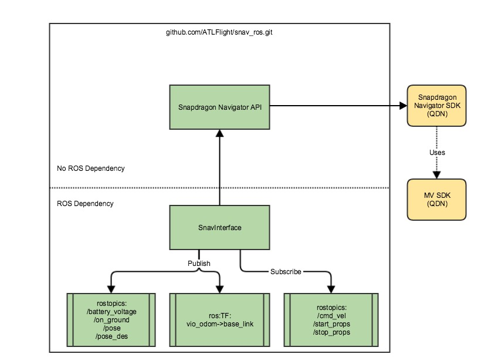

# Snapdragon Navigator<sup>TM</sup> Flight Controller ROS Example

Snapdragon Navigator<sup>TM</sup> is a flight controller that runs on
the Qualcomm Snapdragon Flight<sup>TM</sup> platform. Detailed information
about its capabilities can be found on the [Qualcomm Developer Network
site](https://developer.qualcomm.com/hardware/snapdragon-flight/sd-navigator).

This ROS-based example demonstrates how to interact with the flight controller
using the Snapdragon Navigator<sup>TM</sup> API. The flight stack uses the [Machine Vision SDK's](https://developer.qualcomm.com/hardware/snapdragon-flight/machine-vision-sdk) VISLAM
feature to estimate the 6DOF pose, enabling accurate indoor localization of the
drone. The 6DOF pose estimate and other useful data are published by this node.

This example assumes that you have a flyable Snapdragon-based drone (with
RC/WiFi controller, ESC's, propellers, and Snapdragon Flight board) and are
comfortable flying a drone.


## Table of Contents

1. [High-level block diagram](#high-level-block-diagram)
1. [Pre-requisites](#pre-requisites)
   * [Hardware](#hardware)
   * [Software](#software)
1. [Clone and build example code](#clone-and-build-example-code)
1. [Run example code](#run-example-code)
1. [Verification](#verification)
1. [FAQ](#faq)

## High-level block diagram



## Pre-requisites

### Hardware
This example requires the following hardware:

* [Qualcomm Snapdragon Flight Kit](https://shop.intrinsyc.com/collections/product-development-kits/products/qualcomm-snapdragon-flight-sbc)
* [Qualcomm Electronic Speed Control (ESC) board](https://shop.intrinsyc.com/collections/dragonboard-accessories/products/qualcomm-electronic-speed-control-board)
* Drone frame + Props - Coming Soon

### Software
To run the example, the following are needed:

* [Plaform Image from Intrynsic 3.1.3.1](https://support.intrinsyc.com/attachments/download/1597/Flight_3.1.3.1_JFlash.zip)
* [Platform Addon from Intrynsic 3.1.3.1](https://support.intrinsyc.com/attachments/download/1571/Flight_3.1.3.1_qcom_flight_controller_hexagon_sdk_add_on.zip)
* [Qualcomm Snapdragon Navigator Flight Controller SDK 1.2.31](https://developer.qualcomm.com/download/snapdragon-flight/navigator-controller-v1.2.31)
* [Qualcomm Machine Vision SDK 0.9.1](https://developer.qualcomm.com/download/snapdragon-flight/machine-vision-sdk-v091.deb)
* [ROS on target](https://github.com/ATLFlight/ATLFlightDocs/blob/master/SnapdragonROSInstallation.md)
* [Qualcomm Snapdragon ESC Firmware 1.2.0](https://developer.qualcomm.com/download/snapdragon-flight/navigator-controller-esc-firmware-v1.2.0)


## Clone and build example code

### Setup ROS workspace on target

```
adb shell
source /home/linaro/.bashrc
mkdir -p /home/linaro/ros_ws/src
cd /home/linaro/ros_ws/src
catkin_init_workspace
cd ../
catkin_make
echo "source /home/linaro/ros_ws/devel/setup.bash" >> /home/linaro/.bashrc
```

This ensures that the ROS workspace is setup correctly.

### Clone the sample code
* The repo may be cloned from [here](https://github.com/ATLFlight/snav_ros.git) directly on the target, or cloned on the host computer and then pushed to the target using ADB. The recommended method is to clone directly on the target.

```
adb shell
source /home/linaro/.bashrc
roscd
cd ../src
git clone https://github.com/ATLFlight/snav_ros.git
```

### Instal ROS dependencies

This package depends on other ROS packages to run.  To install them, we'll use [rosdep](http://wiki.ros.org/rosdep)

```bash
roscd snav_ros
rosdep install . --from-paths
```
This requires an internet connection as it will install the rosdeps using aptitude.

If you get an apt error while trying to install the dependencies like this:

```bash
trying to overwrite '/usr/share/glib-2.0/schemas/gschema.dtd', which is also in package libglib-2.0-0 1:2.38.2-r0. this is while trying to install the dependency libglib2.0-dev_2.40.0-2_armhf.deb
```
then you will need to force dpkg to overwrite platform files with files from aptitude.  To do that, run this command:

```bash
sudo apt-get -o Dpkg::Options::="--force-overwrite" –f install
```
Now re-run the rosdep install:

```bash
rosdep install . --from-paths
```

### Build the code

```bash
cd /home/linaro/ros_ws
catkin_make
```

This will compile the executable `snav_interface_node`.  This node uses the
Snapdragon Navigator<sup>TM</sup> API and therefore needs to be run as root.  It is best if the linaro user
can run this with root permissions, as this enables use of roslaunch.
CMakelists.txt contains a custom command to run when building that sets the UID
bit on the node.  This allows it to run with root permission from any user.  As
long as you have password-less sudo access, building this code normally (with
catkin_make) should enable roslaunch of the snav_ros node with appropriate
permissions.


## Run example code

This example assumes that the user is familiar with ROS framework.  If you are new to ROS, refer to [ROS Start Guide](http://wiki.ros.org/ROS/StartGuide) first to get started.

This assumes that the ROS build command is successful.

There is a launch file that will run the snav_interface_node and also start up roscore.  To run:
```bash
roslaunch snav_ros snav_ros.launch
```
Take a look at the [launch file](launch/snav_ros.launch) to see what params are available.

## Verification

Data from Snapdragon Navigator<sup>TM</sup> such as the 6DOF pose can be viewed on a host machine running ROS.

On your workstation, assuming you have installed ROS, set up you environment variable to point to your target.  These values assume you are in softap mode and your target has IP=192.168.1.1
```bash
export ROS_MASTER_URI=http://192.168.1.1:11311
export ROS_IP=192.168.1.77
```

Replace the value of ROS_IP with your real IP address of your workstation.  After that, you can check that data is coming in.
First, check out what topics are being published:

```bash
rostopic list
```

Use `rostopic echo` to verify that data is streaming. For example, to view the
battery voltage in Volts:

```bash
rostopic echo /battery_voltage
```

To view the transforms being published:

```bash
rostopic echo /tf
```

These commands should show a stream of live data. If they do not, your ROS_IP
env variable may need to be set on target.  On the target, kill the roslaunch
session and run:

```bash
export ROS_IP=192.168.1.1
```

This assumes softap mode.  Rerun the launch file and try again. If everything is working:

```bash
rosrun rviz rviz
```

Now set the fixed_frame to "/vio/odom" and add a TF display type. Now watch the /base_link coordinate frame (vio estimate) move around as the quad moves!

## FAQ

### Why isn't snav_ros publishing anything?

Snapdragon Navigator<sup>TM</sup> must be running before `snav_ros` is launched. If you see the following
error messages:

```
Update checksum_failure. [f0eb75d8,0e5675fe] Possible RPC issue.
[ WARN] [8780.150406550]: sn_update_data failed, not publishing
```

there is a good chance that Snapdragon Navigator<sup>TM</sup> is not running. Kill `snav_ros` and start
Snapdragon Navigator<sup>TM</sup> with the following command:

```bash
sudo start snav
```

and then relaunch `snav_ros`.

